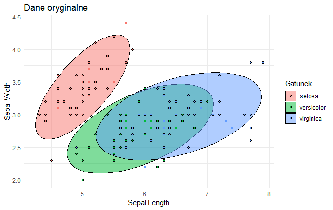
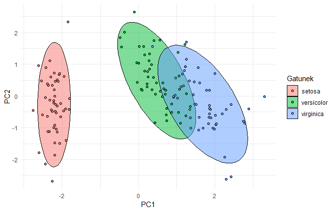

W sieci dostępne jest multum informacji na czym polega metoda PCA, jednak ich istotnym problemem jest to, że za  bardzo skupiają się na stronie matematycznej, a za mało na tym jak interpretować, rozumieć i wyjaśniać wyniki osobom nieobeznanym w statystyce i naukach ścisłych.

```{r document_setup, echo=FALSE, message=FALSE, error=FALSE, warning=FALSE}
library(tidyverse)
library(knitr)
library(kableExtra)

# chunks options
opts_chunk$set(message = FALSE, error = FALSE, warning = FALSE)
options(knitr.table.format = "html") 

source("/home/lemur/RProjects/!Rmarkdown_templates/da_plot.R")
```


> Dzisiejszy wpis jest wpisem gościnnym - autorem poniższego tekstu jest [dr Iwo Augustyński](http://iwoaugustynski.ue.wroc.pl/pl/).

W sieci dostępne jest multum informacji na czym polega metoda PCA, jednak ich istotnym problemem według mnie jest to, że za  bardzo skupiają się na stronie matematycznej a za mało na tym jak interpretować, rozumieć i wyjaśniać wyniki osobom nieobeznanym w statystyce i naukach ścisłych. Celem poniższego artykułu jest wypełnienie tej luki.
Zanim jednak przejdziemy do wyjaśnień parę słów wstępu na temat działu statystyki, z którego metoda PCA się wywodzi.

## Analiza czynnikowa

Rola analizy czynnikowej jest raczej skromna - może ona dopomóc do uzyskania pierwszych przybliżonych zarysów prawidłowości, tkwiących u podłoża danej dziedziny. [1, s. 18]. Jej zaletą jest jednak to, że metoda ta, w znacznie mniejszym stopniu niż inne, wymaga tworzenia wstępnych hipotez. [1, s.25] Nie wymaga też wstępnych założeń co do tego, które zmienne są niezależne, a które zależne, nie przesądza sprawy związku przyczynowego. [1, s.28]

Główne założenie analizy czynnikowej można sformułować następująco: **zjawiska w określonej dziedzinie badań mimo całej swej różnorodności i zmienności są ze sobą jakoś powiązane i jednocześnie, przynajmniej w części wyznaczone przez stosunkowo małą ilość jednostek funkcjonalnych, parametrów albo czynników**. [1, s.18]


Zastosowania analizy czynnikowej nie ograniczają się do wstępnych stadiów badania. Ponieważ jest ona dość czułym narzędziem ilościowym, może służyć bardziej niż inne metody statystyczne do sprawdzania bardziej złożonych hipotez. Przy pomocy analizy czynnikowej możemy nie tylko stwierdzać *czy* istnieje jakaś zależność ale również ustalać *w jakiej mierze* istnieje. [1, s.27]

**W analizie czynnikowej opieramy się na korelacjach**. Najczęściej posługujemy się zwykłym współczynnikiem korelacji Pearsona, który opiera się na założeniu, że badana zależność ma charakter prostoliniowy, tzn. przedstawiona w formie wykresu da linię prostą [1, s.22]. Nie jest to jednak wielki problem gdyż metoda ta, jak wspomniano służy uzyskaniu wstępnych, przybliżonych zarysów prawidłowości.
Trzeba dodać, że współczynnik Pearsona nadaje się do zmiennych wymierzalnych w sposób ciągły i raczej dla większych prób (N>=50).

## Metoda PCA
Metoda PCA jest szczególnym przypadkiem analizy czynnikowej. Tak samo jak ona może służyć do takiego przekształcenia danych aby uzyskać jak największe różnice w korelacjach między zmiennymi. Do tego celu wykorzystuje ona właściwości wektorów własnych (eigenvectors) i wielkości własnych (eigenvalues). Ich cechy szczególne a zwłaszcza ortogonalność (prostopadłość) stanowi o tym, że metoda ta stanowi tylko fragment analizy czynnikowej. 

Cechy wektorów własnych:

* występują tylko dla macierzy kwadratowych
* nie każda macierz kwadratowa je ma
* macierz o wymiarach nxn ma (jeśli w ogóle) n wektorów własnych
* wszystkie są do siebie prostopadłe
* wszystkie zaczynają się w punkcie 0 
* każdemu wektorowi własnemu towarzyszy wartość własna
 
Wielkość wartości własnej prezentuje "rozpiętość danych" wokół prostej na której leży wektor własny (stąd jego długość nie ma znaczenia i zwykle się go podaje w takiej postaci, żeby miał długość jeden).

W PCA zakłada się, że im większa rozpiętość (czyli wariancja) tym lepsza zmienna (cecha) bo niesie w sobie więcej informacji. I odwrotnie, jeśli wartość własna jest bardzo mała --> wariancja jest bardzo mała --> dane są skupione na prostej, na której leży dany wektor własny --> cecha wnosi niewiele informacji.

Więc, jeżeli cech jest n to mamy n wymiarową macierz kowariancji i 0 lub n wektorów własnych z towarzyszącymi im wartościami własnymi.
Jeśli uporządkujemy następnie wektory te według wartości własnych od największej do najmniejszej to w ten sposób uporządkujemy cechy od najbardziej "różnorodnej" do najbardziej "skupionej".

Po takim uszeregowaniu można na przykład uznać, że ignorujemy cechy, dla których wartości własne są poniżej przyjętego progu.
Im więcej cech wyeliminujemy tym bardziej ograniczymy liczbę wymiarów bo "wycinamy" część wektorów własnych (prostych, na których leżą). Można więc na przykład przyjąć, że  wybieramy tylko 3 najważniejsze cechy, bo tyle wymiarów da się pokazać na obrazku.

## Jak interpretować wyniki PCA?

Po tym dość teoretycznym wstępie (jeśli był jednak za krótki to polecam źródła podane na końcu) pora odpowiedzieć na tytułowe pytanie.

Zacznijmy od takiego przykładu - zebraliśmy następujące dane na temat mieszkań w naszym mieście:

* wielkość (m2)
* liczba pokoi
* liczba łazienek
* liczba przystanków (linii) MPK w okolicy
* poziom przestępczości

Zebrane dane miałyby postać tabeli:

| wielkość (m2) | l. pokoi | l. łazienek | l. przystanków | poziom przestępczości |
| ---- | ---- | ---- | ---- | ---- |
| a1 | b1 | c1 | d1 | e1 |
| a2 | b2 | c2 | d2 | e2 |
| . | . | . | . |. |
| an | bn | cn | dn | en |


Chcemy sprawdzić, czy występują jakieś ukryte zależności łączące ze sobą niektóre z tych cech w grupy. Naturalnie grup tych nie może być więcej niż cech (jedna cecha nie może być w więcej niż jednej grupie).


Jeśli się bliżej przyjrzymy naszemu przykładowi to będziemy mogli wytypować dwa "ukryte" czynniki "sterujące" naszymi cechami "spoza sceny":

| rozmiar | lokalizacja |
|------|------|
| wielkość | liczba przystanków MPK |
| liczba pokoi | poziom przestępczości |
| liczba łazienek |  |

Prawdopodobne jest istnienie bliskiego związku (korelacji) w ramach pierwszej grupy i w ramach drugiej grupy oraz brak związku między cechami z różnych grup.
Metoda PCA robi właśnie to co zrobiliśmy metodą "na zdrowy rozum" a nawet o wiele więcej. Bo co z tego, że utworzyliśmy dwie grupy, skoro cech nadal mamy pięć. PCA jest za to w stanie określić, które grupy najmniej wnoszą do wyjaśnienia struktury danych.

### Jak to robi?

Spójrzcie na zdjęcie poniżej.


Jak widać przedstawia ono trójwymiarowe zdjęcie twarzy (plus nieinteresujące nas dodatki). Możemy na nie patrzeć z różnych stron. Na zdjęciu widzicie właśnie cztery dwuwymiarowe rzuty trójwymiarowej bryły. Jeśli z tych czterech rzutów wybierzemy  np. dwa, które najwięcej mówią nam o przedstawionej postaci, to właśnie (w przybliżeniu) przeprowadzimy proces redukcji zmiennych przy wykorzystaniu metody PCA. 
PCA niejako "proponuje" nam najlepsze "punkty patrzenia" na dane a my decydujemy co dalej: czy z części z nich rezygnujemy czy staramy się zrozumieć uwidocznione relacje między cechami.

Schemat postępowania można więc opisać następująco:

1. Przesuwamy naszą bryłę (zbiór punktów) tak, żeby mieć ją centralnie na wprost.
2. Obracamy tak, żeby punkty te zajmowały jak największą powierzchnię widzenia.
3. Sprawdzamy co widać z pozostałych stron: obracamy bryłę za każdym razem o 90 stopni (w PCA, w ogólnej analizie czynnikowej niekoniecznie).
4. Odrzucamy te strony, z których najmniej widać (redukcja danych) lub staramy się zrozumieć dlaczego z danego punktu widzenia punkty utworzyły wyróżniające się grupy (analiza danych).

Jeśli mielibyśmy trójwymiarowe zdjęcie kuli zamiast twarzy, to PCA nic by nam nie dało, bo kula z każdej strony wygląda tak samo. Jeśli jednak punkty układają się w kulę to oznacza, że nie ma między nimi korelacji a PCA opiera się na korelacji właśnie. Dlatego przeciwne ekstremum zajmuje linia prosta, która oznacza, że wszystkie cechy są ze sobą w 100% skorelowane. Wtedy wystarczy jeden wymiar (czyli prosta), żeby zachować wszystkie informacje.

Inny przykład:

Mamy [dane na temat irysów](https://en.wikipedia.org/wiki/Iris_flower_data_set) (petal to płatek a sepal to [zielona działka kielicha](https://pl.wikipedia.org/wiki/Kielich_(botanika))):

| Petal.Length | Sepal.Width  | Petal.Length | Petal.Width  |      Gatunek |
|:-------------|:-------------|:-------------|:-------------|:-------------|
|Min.   :4.300 |Min.   :2.000 |Min.   :1.000 |Min.   :0.100 |setosa    :50 |
|Mediana :5.800 |Mediana :3.000 |Mediana :4.350 |Mediana :1.300 |versicolor :50 |
|Średnia   :5.843 |Średnia   :3.057 |Średnia   :3.758 |Średnia   :1.199 |virginica :50 |         |
|Max.   :7.900 |Max.   :4.400 |Max.   :6.900 |Max.   :2.500 |            |

Jak widać mamy cztery wymiary plus dla każdego kwiatka przyporządkowaną nazwę gatunkową. Wszytkich kwiatków w bazie jest 150. Wartości cech pierwszych 10 irysów wygladają następująco:

| Sepal.Length| Sepal.Width| Petal.Length| Petal.Width|
|------------:|-----------:|------------:|-----------:|
|          5.1|         3.5|          1.4|         0.2|
|          4.9|         3.0|          1.4|         0.2|
|          4.7|         3.2|          1.3|         0.2|
|          4.6|         3.1|          1.5|         0.2|
|          5.0|         3.6|          1.4|         0.2|
|          5.4|         3.9|          1.7|         0.4|
|          4.6|         3.4|          1.4|         0.3|
|          5.0|         3.4|          1.5|         0.2|
|          4.4|         2.9|          1.4|         0.2|
|          4.9|         3.1|          1.5|         0.1|

Chcąc wykorzystać metodę PCA należy najpierw dane znormalizować (przesunąć tak, żeby środek układu współrzędnych był pośrodku danych oraz dane były w tej samej skali np. liczby odchyleń standardowych). Po tej operacji cechy naszych kwiatków będą wyglądały tak:

| Sepal.Length| Sepal.Width| Petal.Length| Petal.Width|
|------------:|-----------:|------------:|-----------:|
|        -0.90|        1.02|        -1.34|       -1.31|
|        -1.14|       -0.13|        -1.34|       -1.31|
|        -1.38|        0.33|        -1.39|       -1.31|
|        -1.50|        0.10|        -1.28|       -1.31|
|        -1.02|        1.25|        -1.34|       -1.31|
|        -0.54|        1.93|        -1.17|       -1.05|
|        -1.50|        0.79|        -1.34|       -1.18|
|        -1.02|        0.79|        -1.28|       -1.31|
|        -1.74|       -0.36|        -1.34|       -1.31|
|        -1.14|        0.10|        -1.28|       -1.44|


Na rysunkach efekt widać lepiej:



Oba obrazki różnią się jedynie cyframi na osiach.

Do tak poprawionych danych można zastosować PCA. W efekcie ten czterowymiarowy zbiór kwiatków zostaje obrócony tak, żeby jak najbardziej uwydatnić różnice między nimi (nawiązując do poprzedniego przykładu teraz "patrzymy danym prosto w twarz"):


W efekcie gatunek "setosa" różni się znacznie wyraźniej niż w oryginalnych danych a pozostałe dwa gatunki pokrywają się w znacznie mniejszym zakresie. Punkty w ramach każdego gatunku uległy również zagęszczeniu.

### Podsumowanie

Metodę PCA można stosować tylko do danych liczbowych (czyli nie czynnikowych takich jak gatunek w drugim przykładzie, choćby były kodowane numerami jak np. linie autobusowe) zarówno do wstępnej analizy danych jak i do redukcji liczby cech (wymiarów). Może ona dopomóc w uzyskaniu pierwszych przybliżonych zarysów prawidłowości, tkwiących u podłoża danego zjawiska. Wstępnych, ponieważ opiera się na korelacji, [która może być bardzo myląca](http://tylervigen.com/spurious-correlations). 

Mam nadzieję, że powyższy wpis pomoże Wam zrozumieć lub lepiej wyjaśnić innym na czym polega ta tak popularna w data science metoda.

dr Iwo Augustyński

--------------------
Opracowano na podstawie:

* Jan Okoń, "Analiza czynnikowa w psychologii", PWN, Warszawa 1964
* [A tutorial on Principal Components Analysis](http://www.cs.otago.ac.nz/cosc453/student_tutorials/principal_components.pdf) (pdf)
* [Introduction to eigenvalues and eigenvectors](https://www.khanacademy.org/math/linear-algebra/alternate-bases/eigen-everything/v/linear-algebra-introduction-to-eigenvalues-and-eigenvectors) (video)
* [Dimensionality Reduction For Dummies — Part 2: Laying The Bricks](https://towardsdatascience.com/dimensionality-reduction-for-dummies-part-2-3b1e3490bdc9)
* [Dimensionality Reduction For Dummies — Part 3: Connect The Dots](https://towardsdatascience.com/dimensionality-reduction-for-dummies-part-3-f25729f74c0a)
* [Principal Component Analysis (PCA)](https://youtu.be/g-Hb26agBFg) (video)
* [Principal components analysis in R](https://youtu.be/xKl4LJAXnEA) (video)
