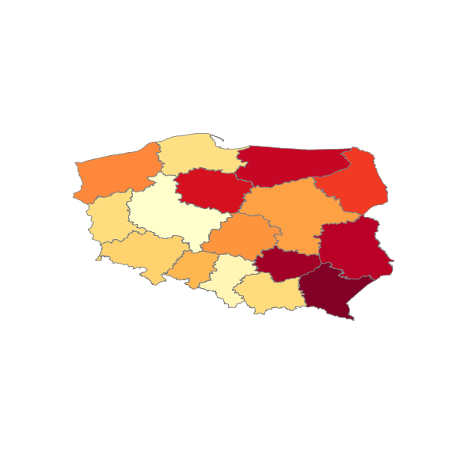
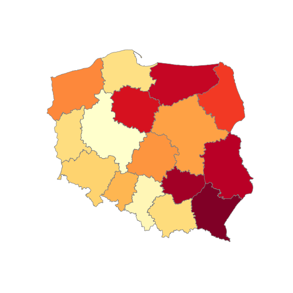

Jakiś czas temu pokazywałem jak w prosty sposób narysować mapę w R. Dzisiaj powtórzymy zadanie dla Pythona.

Skorzystamy z danych GUS na temat bezrobocia oraz liczby ludności (pomijając dokładność *złożenia* danych - interesuje nas rysowanie map, a nie analiza bezrobocia) oraz map z Głównego Urzędu Geodezji i Kartografii.

> Jeśli potrzebujesz podobnych informacji jak zrobić to wszysto w R sprawdź na początek wszystko co jest w ramach tagu [mapa](https://blog.prokulski.science/index.php/tag/mapa/)

### Skąd pobrać dane?

* **Dane o liczbie ludności**: [Ludność / Stan ludności / Ludność wg grup wieku i płci](https://bdl.stat.gov.pl/BDL/metadane/cechy/2137) w tzw. **BDLu** (czyli Banku Danych Lokalnych GUS) - bierzemy dane z 2018 roku (najnowsze pełne jakie są); Wiek = ogółem, Płeć = ogółem; wszystkie jednostki terytorialne. W wyniku klikania dostaniemy się do tabeli, którą ściągamy lokalnie poprzez **Export / CSV - tablica wielowymiarowa**.
* Dokładnie tak samo pozyskujemy **dane o liczbie bezrobotnych**: [Rynek pracy / Bezrobocie rejestrowane / Bezrobotni zarejestrowani wg płci w gminach](https://bdl.stat.gov.pl/BDL/metadane/cechy/1944) (znowu: ogółem, 2019 rok, wszystkie jednostki; pobieramy plik CSV dokładnie tak samo jak wyżej).
* **Dane mapowe** bierzemy z [GUGiK](http://www.gugik.gov.pl/pzgik/dane-bez-oplat/dane-z-panstwowego-rejestru-granic-i-powierzchni-jednostek-podzialow-terytorialnych-kraju-prg) - interesuje nas archiwum [PRG – jednostki administracyjne](ftp://91.223.135.109/prg/jednostki_administracyjne.zip) (uwaga - to ma 375 MB!). To archiwum rozpakowujemy i (coś co ja robię, żeby później nie było problemów) zmieniamy nazwy plików tak, aby pozbyć się polskich znaków i wszystkie litery w nazwie były małe.


### Przygotowanie danych z GUS

Ale zanim - potrzebne nam będzie kilka pakietów Pythona do dalszej pracy:`


```{python}
import pandas as pd
import matplotlib.pyplot as plt
import geopandas as gpd
import folium
```

### Mapy w Shapefile

Pobrane z BDLa pliki mają swoje nazwy, które są zależne od daty wygenerowania danych. Zapiszmy więc je w zmiennych, aby ewentualnie zmieniać je tylko w jednym miejscu:


```{python}
dane_gus_ludnosc_file = 'LUDN_2137_CTAB_20200228102408.csv'
dane_gus_bezrobocie_file = 'RYNE_1944_CTAB_20200228102648.csv'
```

Teraz możemy wczytać i przejrzeć z grubsza te dane. Zaczniemy od ludności:


```{python}
ludnosc_gus = pd.read_csv(dane_gus_ludnosc_file, delimiter=';')
ludnosc_gus.head()
```


Jest tutaj lekki bałagan. Ale co jest czym?

* `Kod` - kolumna odpowiadająca za kod [TERYT](https://pl.wikipedia.org/wiki/TERYT) gminy, a tak na prawdę jest to [TERC](https://pl.wikipedia.org/wiki/TERC). Jeśli chociaż raz analizowałeś (lub -aś) dane geograficzne dotyczące Polski to na pewno to znasz. Będzie to klucz łączący dane z obszarami na mapie.
* `Nazwa` - nazwa regionu. W zależności od regionu będzie to nazwa gminy, powiatu albo województwa. Lub też *POLSKA* dla całego kraju. Do niczego nam to w sumie tutaj nie jest potrzebne.
* `ogółem;ogółem;2018;[osoba]` - to jest interesująca nas liczba, ale nazwa kolumny jest jakimś babolem. Tak to przychodzi z GUSu :(
* ostatnia kolumna to śmieć (bo linie kończą się średnikiem nie wiedzieć czemu)

Zostawimy więc interesujące nas kolumny i zmienimy ich nazwy:


```{python}
ludnosc_gus = ludnosc_gus.iloc[:, 0:3]
ludnosc_gus.columns = ['TERYT', 'Nazwa', 'Ludnosc']
ludnosc_gus.head()
```


Mamy to czego chcieliśmy. Teraz ta sama operacja dla danych o bezrobociu:


```{python}
bezrobocie_gus = pd.read_csv(dane_gus_bezrobocie_file, delimiter=';')
bezrobocie_gus.head()
```


Pierwsze dwie kolumny znaczą to samo co w poprzednim zbiorze, trzecia to liczba zarejestrowanych bezrobotnych. Tym razem pozbędziemy się od razu kolumny z nazwą - nie będzie nam do niczego potrzebna, a am TERYT wystarczy jako klucz łączący.


```{python}
bezrobocie_gus = bezrobocie_gus.iloc[:, [0, 2]]
bezrobocie_gus.columns = ['TERYT', 'Bezrobotni']
bezrobocie_gus.head()
```


Kolejny krok to złączenie danych - w jednej tabeli będziemy trzymać informacje o ludności i liczbie bezrobotnych i na tej podstawie łatwo policzymy stopę bezrobocia.

Tutaj **uwaga** - wynik nie będzie poprawny metodologicznie. Dane o ludności mamy z połowy 2019 roku, a o bezrobociu - z końca lutego 2020. Liczba ludności mogła się zmienić przez te półtora roku. Druga rzecz - w liczbę ludności wchodzą też osoby, które nie są w *wieku produkcyjnym*, więc nie powinny być liczone. Ale ten *drobny niuans* pomijamy, bo naszym celem jest nauczyć się rysować mapę, a nie liczyć stopę bezrobocia. Oczywiście można w GUSie znaleźć dane o liczbie osób w wieku produkcyjnym - niestety nie będą one tak samo aktualne jak te związane z liczbą bezrobotnych. Ale przed nami narodowy spis powszechny, więc niedługo nowe dane o Polakach.


```{python}
# łączymy dane ze sobą - tylko te kody TERYT, które istnieją w obu tabelach
dane_gus = pd.merge(ludnosc_gus, bezrobocie_gus, how='inner', on='TERYT')

# liczymy stopę bezrobocia w każdym z TERYTów:
dane_gus['Stopa_bezrobocia'] = 100* dane_gus['Bezrobotni'] / dane_gus['Ludnosc']

# 10 przykładowych wierszy:
dane_gus.sample(10)
```


Wydawać się może, że to wszystko. Ale... poczekajmy ;)

#### Wczytanie mapy

Czas na wczytanie naszych danych geograficznych. Użyjemy dwóch map: podziału na gminy i podziału na województwa. Bo też narysujemy dwie mapki - dwoma sposobami! Ha, jaka niespodzianka :)

Zaczynamy od wczytania danych z Shapefile (taki format danych - to pobraliśmy z GUGiK):


```{python}
# mapa z województwami:
mapa_woj = gpd.read_file('../map_data/wojewodztwa.shp')
mapa_woj.dtypes
```


```{python}
# mapa z gminami:
mapa_gmn = gpd.read_file('../map_data/gminy.shp')
mapa_gmn.dtypes
```


Co my tutaj mamy? Dużo różnych kolumn, ale interesują nas tak naprawdę tylko dwie: `JPT_KOD_JE` oraz `geometry`. Pierwsza to po prostu kod TERYT, a druga opisuje kształt obszaru. Zostawmy więc sobie tylko te dwie kolumny i zobaczmy jak wyglądają dane:


```{python}
mapa_woj = mapa_woj[['JPT_KOD_JE', "geometry"]]

mapa_gmn = mapa_gmn[['JPT_KOD_JE', "geometry"]]
mapa_gmn.head()
```


Proszę zwrócić uwagę, że kody TERYT (dla gmin) mają *wiodące zero* i zawsze jest to 7 cyfr. W danych z GUS pandas potraktował tę kolumnę jako liczbę i obciął nam wiodące zera. Można o to zadbać na poziomie wczytywania danych (odpowiednia wartość parametru `dtype` dla `pd.read_csv()`) ale trzeba znać listę kolumn.

Zamiast tego zrobimy korektę w naszych danych przy okazji wyłuskując kod TERYT województwa z kodu gminy:


```{python}
# kod ma być stringiem o stałejdługości (dodanie wiodących zer)
dane_gus['TERYT_gmn'] = dane_gus.TERYT.apply(lambda x: '0'+str(x) if len(str(x)) < 7 else str(x))

# TERYT województwa
dane_gus['TERYT_woj'] = dane_gus.TERYT_gmn.apply(lambda s: s[:2])

dane_gus.head()
```


Jeszcze przydałoby się usunąć agregaty do poziomu powiatów oraz informację dla całego kraju. Rozdzielimy też tabelę na dane o gminach i województwach.

Powiat charakteryzuje się tym, że ostatnie 3 cyfry w kodzie TERYT to zera, zaś w przypadku województwa - to ostatnie 5 cyfr jest zerami. Zadanie więc dość proste:`


```{python}
# usuwamy wiersz dla całego kraju:
dane_gus = dane_gus[dane_gus['TERYT'] != '0']

# wybieramy same województwa - 00000 na końcu
dane_gus_woj = dane_gus[dane_gus.TERYT_gmn.str[2:7] == '00000']
dane_gus_woj
```


```{python}
# wybieramy same gminy - 00000 na końcu
dane_gus_gmn = dane_gus[dane_gus.TERYT_gmn.str[4:7] != '000']
dane_gus_gmn
```


### Narysowanie mapy - matplotlib

To teraz najciekawsze - rysujemy wreszcie mapę.

Pierwsze podejście to użycie standardowego `matplotlib`. Aby tego dokonać znowu musimy połączyć dane do jednego *data frame'a*. Zajmijmy się województwami.


```{python}
# łączymy tabelę opisującą kształt województw z danymi o bezrobosiu w województwach
dane_mapa_woj = pd.merge(mapa_woj, dane_gus_woj, how='left', left_on='JPT_KOD_JE', right_on='TERYT_woj')
dane_mapa_woj
```

```{python eval=FALSE}
## rysujemy mapkę:
# wielkość naszego obrazka
fig, ax = plt.subplots(1, figsize = (8,8))

# rysowanie mapy
dane_mapa_woj.plot(column='Stopa_bezrobocia', ax=ax, cmap='YlOrRd', linewidth=0.8, edgecolor='gray')

# usuwamy osie
ax.axis('off')

# pokazujemy obrazek
plt.savefig('bezrobocie_woj_1.png')
# plt.show()
```




Wyszło jakoś, chociaż kształt Polski jest spłaszczony. Odpowiada za to kodowanie współrzędnych w plikach z GUGiK. Dane o współrzędnych trzeba nieco przekonwertować (było trochę googlania za wartością EPSG, macie gotowy efekt poniżej) Zróbmy to i powtórzmy operację rysowania:


```{python eval=FALSE}
dane_mapa_woj = dane_mapa_woj.to_crs(epsg=2180)

fig, ax = plt.subplots(1, figsize = (8,8))
dane_mapa_woj.plot(column='Stopa_bezrobocia', ax=ax, cmap='YlOrRd', linewidth=0.8, edgecolor='gray')
ax.axis('off')
plt.savefig('bezrobocie_woj_2.png')
# plt.show()
```




Od razu lepiej!

### Narysowanie mapy - Folium

A gdyby tak zrobić mapę interaktywną? Taką, którą można przesuwać i skalować? Do tego użyjemy pakietu `Folium` oraz danych na poziomie gmin.

Jednak `Folium` potrzebuje danych o obszarach w formacie GeoJSON, zatem musimy je odpowiednio przygotować.

#### Uproszczenie kształtu

W pierwszej kolejności uprościmy (*zaokrąglimy*) dane mapowe, aby nie zajmowały zbyt wiele miejsca. Będzie to miało wpływ na niedokładność kształtów gmin.


```{python}
# uproszczenie geometrii
mapa_gmn.geometry = mapa_gmn.geometry.simplify(0.005) # mniejsza wartosc = bardziej dokładnie

# dane do GeOJSON na potrzeby Folium
gmn_geoPath = mapa_gmn.to_json()
```

Teraz już możemy rysować naszą mapkę:


```{python, eval=FALSE}
# 52,19 to w przybliżeniu środek mapy w postaci lat,long
mapa = folium.Map([52, 19], zoom_start=6)

folium.Choropleth(geo_data=gmn_geoPath, # GeJSON z danymi geograficznymi obszarów
                  data=dane_gus_gmn, # data frame z danymi do pokazania
                  columns=['TERYT_gmn', 'Stopa_bezrobocia'], # kolumna z kluczem, kolumna z wartościami
                  key_on='feature.properties.JPT_KOD_JE', # gdzie jests klucz w GeoJSON?
                  fill_color='YlOrRd', 
                  fill_opacity=0.7,
                  line_opacity=0.2,
                  legend_name="Stopa bezrobocia w gminie").add_to(mapa)

# zapisanie utworzonej mapy do pliku HTML
mapa.save(outfile = 'bezrobocie_gminy.html')

# pokazujemy mapę
# mapa
```

<iframe src="bezrobocie_gminy.html" width="100%" height="300" frameBorder="0" scrolling="no">Tu powinna być mapa.</iframe > 


Przy dużym zoomie widać, że granice gmin się ze sobą nie stykają - to wynik uproszczenia geometrii. Bez tego kroku powinno wszystko do siebie pasować.

> Jeśli potrzebujesz podobnych informacji jak zrobić to wszysto w R sprawdź na początek tekst [Mapy, mapy raz jeszcze](/index.php/2017/12/22/mapy-w-r-rgeos/) oraz wszystko co jest w ramach tagu [mapa](/index.php/tag/mapa/)

Ale widać też coś innego - niektóre z gmin są szare. Dlaczego? Ponieważ brakuje dla nich danych. To z kolei wynika z rozbieżności pomiędzy kodami TERYT w danych geograficznych z GUGiK oraz danych o bezrobociu z GUS. Najczęściej chodzi o to, że w GUS są bardziej aktualne dane uwzględniające na przykład zmianę charakteru gminy (ostatnia cyfra w kodzie TERYT) z wiejskiej na miejską lub odwrotnie. Podobny problem można spotkać w przypadku Warszawy - dane mapowe traktują ją jako całość, a dane w GUS często odnoszą się do każdej z dzielnic (i tym samym gmin) oddzielnie.

Jak z tym sobie poradzić? Najprościej byłoby nie przejmować się ostatnią cyfrą w kodzie TERYT. Wówczas trzeba wykonać dwa ruchy *wyprzedzające*:

* obciąć kod TERYT do 6 cyfr i agregować dane do tak powstałych kodów - dla danych np. z GUS. To dość proste przekształcenie w Pandas
* zrobić dokładnie to samo dla danych mapowych - tutaj agregacja jest nieco trudniejsza (obliczeniowo), ale [dokumentacja](https://geopandas.org/aggregation_with_dissolve.html) wyjaśnia co i jak


Problemem jaki się wówczas pojawi będzie brak różnicy dla obszarów, gdzie jedną z gmin jest miasto (lub większa wieś), a drugą - teren wokół niego.
---

> Mam nadzieję, że dzisiaj zdobyta wiedza na coś Ci się przyda. Wiedza za darmo, ale zawsze możesz [postawić witrualną kawę](https://www.paypal.me/prokulski/10pln).

Jeśli prowadzisz biznes i zadajesz sobie jakieś pytania to może **[mogę Ci pomóc](/index.php/oferta/)**? Trochę już w swoim życiu danych przerzuciłem w różne strony, trochę pytań zadałem. I projektów zrobiłem.


Jeśli chcesz być na bieżąco z tym co dzieje się w analizie danych, machine learning i AI polub **[Dane i Analizy](http://fb.com/DaneAnalizy)** na Facebooku oraz **[rstatspl](https://twitter.com/rstatspl)** na Twitterze. Znajdziesz tam potężną dawkę wiedzy.

Dość prężnie działa też **[konto na Instagramie](https://www.instagram.com/data_science_bitch/)** gdzie znajdziecie różne wykresiki :)
