Czy da się automatycznie rozdzielić film na poszczególne ujęcia?
<!--more-->

Oczywiście da się. Ale jak do tego podejść?

Dzisiejszy wpis to swego rodzaju zapis sposobu rozwiązania problemu. Wielkiej sztuki programistycznej tutaj nie ma, ale (mam nadzieję) ciekawa jest droga przez całą analizę do uzyskania konkretnego efektu.

Obraz cyfrowy składa się z punktów (określonej ich liczbie - wysokość x szerokość) o różnej barwie. Barwę najczęściej opisują trzy składowe: czerwona, zielona i niebieska (RGB). Wideo to nic innego jak ciąg (kolejne klatki) takich statycznych obrazów.

Weźmy zatem każdą klatkę z filmu i policzmy dla niej jakiś wskaźnik oparty na tym co jest na obrazie. Ten wskaźnik pozwoli nam określić czy dwie sąsiednie klatki różnią się od siebie, z kolei ta różnica da szacunkowe miejsce cięcia pomiędzy ujęciami.

Obraz (kolorowy) składa się z trzech (po jednym dla składowych kolorów: czerwonej, zielonej i niebieskiej) *prostokątów* wypełnionych wartościami od 0 do 255. Możemy więc dla każdego z tych prostokątów policzyć na przykład średnią wartość, medianę i sumę (suma akurat będzie idealnie związana ze średnią - w końcu średnia to suma podzielona przez liczbę elementów).

Ale *przestrzeń barw* [RGB](https://pl.wikipedia.org/wiki/RGB) to nie jedyny sposób na zapis barwy punktu. Możemy ją też zapisać w innych przestrzeniach, na przykład [HSV](https://pl.wikipedia.org/wiki/HSV_(grafika)) (*hue* = odcień światła, *saturation* = jego nasycenie oraz *value* = moc światła białego). Wykorzystajmy więc również składowe HSV i zbierzmy dla każdej klatki i każdego z kanałów średnią, medianę i sumę wartości składowych.

Do zebrania wszystkich tych informacji użyjemy Pythona i biblioteki OpenCV. Pandas i NumPy przydadzą się też na później:

```{python eval=FALSE}
import cv2
import numpy as np
import pandas as pd
```

Pierwsze zadanie to wczytanie klatki z filmu (pliku wideo). W OpenCV jest to wręcz banalne:

```{python eval=FALSE}
stream = cv2.VideoCapture(ścieżka_do_pliku)
rst, frame = stream.read()
```

W efekcie tych dwóch linii kodu dostaniemy dwie informacje w dwóch zmiennych:

* **rst** - wynik operacji w postaci True lub False
* **frame** - obiekt z danymi o kolejnej ramce.

Aby pobrać kolejną ramkę - znowu sięgamy do *strumienia* przez `stream.read()`. Co jeszcze ciekawe - jeśli zamiast parametru w postaci ścieżki do pliku wideo podamy zero (czyli `stream = cv2.VideoCapture(0)`) to naszym wejściowym strumieniem będzie obraz z kamery komputera.


**Jak w takiej wczytanej ramce reprezentowany jest obraz?** To prosta 3 wymiarowa tablica, a kolejne wymiary to: szerokość, wysokość i liczba składowych koloru. Co ciekawe - na dzień dobry składowe kolorów ułożone są w kolejności BGR czyli odwrotnie niż jesteśmy przyzwyczajeni. I tak tabelka ze składowymi czerwonymi naszej klatki to:

```{python eval=FALSE}
frame[:, :, 2]
```

Wyżej wspomniałem o tym, że próbkować każdą klatkę będziemy w przestrzeni barw RGB oraz HSV. Jak zmienić przestrzeń barw? W OpenCV dużo spraw jest prostych, ta w szczególności:

```{python eval=FALSE}
frame_hsv = cv2.CvtColor(frame_rgb, cv2.COLOR_BGR2HSV)
```

Gotowy skrypt poniżej:

```{python eval=FALSE}
import cv2
import numpy as np
import pandas as pd
import datetime
import sys

if __name__ == "__main__":
    
    # pobieramy dane z parametrów
    
    # ścieżka do filmu
    MOVIE_PATH = sys.argv[1]
    
    # plik wyjściowy
    OUTPUT_FILE = sys.argv[2]
    
    # czy pokazywać kolejne klatki?
    SHOW_FRAMES = True if sys.argv[3][0].upper() == "T" else False


    # strumień wideo z filmu
    cap = cv2.VideoCapture(MOVIE_PATH)

    # licznik klatek i miejsce na dane wynikowe
    i = 0
    df = pd.DataFrame()

    while True:
        i += 1

        # wczytujemy kolejną klatkę
        rst, frame = cap.read()

        # jeśli się nie udało - kończymy pętlę
        if not rst:
            break

        # jeśli jest szersza niż 300 pikseli to zmniejszamy jej wymiary o połowę
        # w sumie tylko po to, żeby szybciej się to przeliczało i ewentualnie mieściło na ekranie
        if np.shape(frame)[0] > 300:
            frame = cv2.resize(frame, (int(np.shape(frame)[1] / 2), int(np.shape(frame)[0] / 2)))

        # pokzaujemy ramkę RGB jeśli był ustawiony odpowiedni parametr
        if SHOW_FRAMES:
            cv2.imshow("rgb", frame)

        # składowe RGB
        mean_red = np.mean(frame[:, :, 2])
        mean_green = np.mean(frame[:, :, 1])
        mean_blue = np.mean(frame[:, :, 0])

        median_red = np.median(frame[:, :, 2])
        median_green = np.median(frame[:, :, 1])
        median_blue = np.median(frame[:, :, 0])

        sum_red = np.sum(frame[:, :, 2])
        sum_green = np.sum(frame[:, :, 1])
        sum_blue = np.sum(frame[:, :, 0])

        # konwersja do przestrzeni HSV
        frame = cv2.cvtColor(frame, cv2.COLOR_BGR2HSV)

        # pokazujemy ramkę HSV
        if SHOW_FRAMES:
            cv2.imshow("hsv", frame)

        # składowe HSV
        mean_value = np.mean(frame[:, :, 2])
        mean_saturation = np.mean(frame[:, :, 1])
        mean_hue = np.mean(frame[:, :, 0])

        median_value = np.median(frame[:, :, 2])
        median_saturation = np.median(frame[:, :, 1])
        median_hue = np.median(frame[:, :, 0])

        sum_value = np.sum(frame[:, :, 2])
        sum_saturation = np.sum(frame[:, :, 1])
        sum_hue = np.sum(frame[:, :, 0])

        # dodajemy zebrane informacje do tabelki
        df = df.append(pd.DataFrame({"frame": i,
                                     "mean_red": mean_red,
                                     "mean_green": mean_green,
                                     "mean_blue": mean_blue,
                                     "median_red": median_red,
                                     "median_green": median_green,
                                     "median_blue": median_blue,
                                     "sum_red": sum_red,
                                     "sum_green": sum_green,
                                     "sum_blue": sum_blue,
                                     "mean_value": mean_value,
                                     "mean_saturation": mean_saturation,
                                     "mean_hue": mean_hue,
                                     "median_value": median_value,
                                     "median_saturation": median_saturation,
                                     "median_hue": median_hue,
                                     "sum_value": sum_value,
                                     "sum_saturation": sum_saturation,
                                     "sum_hue": sum_hue},
                                    index=[0]))

        
        # naciśnięcie ESC powoduje wyjście z pętli
        k = cv2.waitKey(10) & 0XFF
        if k == 27:
            break

            
    # zamykamy otwarte okienka z podglądem klatek
    if SHOW_FRAMES:
        cv2.destroyAllWindows()
        
    # zapisujemy dane do pliku CSV
    df.to_csv(OUTPUT_FILE, sep=";", index=False, decimal=',')
```


Przydałby się teraz jakiś film, na którym zbadamy wspólnie dalsze pomysły. Nie za długi i z kilkoma rozpoznawalnymi cięciami. Najlepiej kolorowy. Weźmy więc scenę pojedynku z filmu **Dobry, zły i brzydki** często prezentowaną przy okazji omawiania technik montażu filmowego.

Obejrzyjcie ten krótki fragment, zwróćcie uwagę na to, że ujęcia są bardzo długie, a w kulminacyjnym punkcie cięcia występują coraz częściej. Widać też, że nie wszystkie ujęcia są statyczne - mamy ruch w ramach kadru albo dym z rewolwerów zasłaniający całą klatkę. Spróbuj zapamiętać sekwencję tych elementów.

<center><iframe width="560" height="315" src="https://www.youtube.com/embed/5PgAKzmWmuk" frameborder="0"></iframe></center>


[Film](https://www.youtube.com/watch?v=5PgAKzmWmuk) ściągamy z YouTube na przykład przy pomocy [narzędzia](https://youtube-mp4.download/en/fast-converter).


Wróćmy do naszych zabaw pythonowych - możemy przeliczyć całość korzystając z przygotowanego skryptu (zakładam, że nazywa się on *skrypt.py*). Uruchamiamy więc w konsoli:

```{bash eval=FALSE}
python skrypt.py ścieżka_do_filmu wyjściowy_plik.csv T
```

Ostatni parametr (**T**) odpowiada za wyświetlenie w okienku kolejnych klatek filmu. Można oczywiście to sobie odpuścić i wpisać jakąkolwiek inną niż **t** (duże lub małe) literę. Chwilę to się przemieli (w zależności od długości filmu; podgląd lekko spowalnia całość).


Mając te *zaagregowane* wartości dla każdej klatki możemy zacząć coś kombinować i szukać sposobu na znalezienie cięć.

Przeanalizujmy w pierwszej kolejności jak kształtują się w czasie poszczególne wartości. Dane zapisałem do pliku *good_bad_ugly.csv*.

```{python eval=FALSE}
# potrzebne biblioteki:
import pandas as pd

import matplotlib.pyplot as plt
import seaborn as sns


# wczytujemy plik CSV wygenerowany przez wcześniejszy skrypt
frame_data = pd.read_csv("good_bad_ugly.csv", sep=";", decimal=",")

# zmiana numeru klatki na czas; film na 24 klatki/sekundę
frame_data['time_s'] = pd.to_datetime(frame_data['frame'] / 24, unit='s')
```

W przestrzeni RGB średnie dla kolejnych klatek wyglądają następująco:

```{python eval=FALSE}
# średnie w przestrzeni RGB
fig = plt.figure(figsize=(15,6))
sns.lineplot(data=frame_data, x='time_s', y='mean_red', color='red')
sns.lineplot(data=frame_data, x='time_s', y='mean_green', color='green')
sns.lineplot(data=frame_data, x='time_s', y='mean_blue', color='blue')
plt.title('Średnie wartości składowych R, G, B dla kolejnych klatek')
plt.xlabel('Czas')
plt.ylabel('Średnia wartość składowej koloru')
plt.show()
```

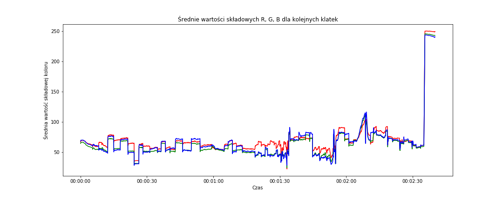

Widzimy przede wszystkim, że pod sam koniec ekran robi się biały. Jeśli zerkniecie w okolice 2:35 to właśnie tak jest - pojawia się plansza z nazwą kanału na YouTube.

Chwilę wcześniej (okolice 2:10) widać wzrost wartości każdej ze składowych w okolice 110 - to koniec właściwego fragmentu filmu i pojawienie się planszy reklamującej inne filmiki, a plansza ta ma sporo szarego. Jednakowe wartości składowych R, G oraz B to odcień szarości (od czarnego z wartościami (0,0,0) do białego - wartości (255,255,255)).

Nas interesuje wszystko to, co dzieje się wcześniej, czyli właściwy fragment filmu **Dobry, zły i brzydki**. Na poziomie uśrednionych wartości składowych w przestrzeni RGB widać schodki, szczególnie na składowej niebieskiej i zielonej. To, że dzieje się tak akurat dla niebieskiego i zielonego może być szczególnym przypadkiem dla tego filmu. Pamiętajmy, że chcemy przygotować uniwersalny algorytm. Interesują nas zatem gwałtowne różnice pomiędzy kolejnymi ujęciami.

Jedna uwaga - na filmie z YouTube mamy czarne pasy u góry i na dole ekranu, co zaburza pomiary. Dla lepszego efektu dobrze byłoby wyciąć je przed dalszą analizą (OpenCV, a właściwie NumPy, pozwala na to w dość prosty sposób - wystarczy wybrać odpowiedni fragment tablicy `crop_img = img[y1:y2, x1:x2]`), ale tutaj pominę ten fragment.

Sprawdźmy to samo na medianach:

```{python eval=FALSE}
# mediany w przestrzeni RGB
fig = plt.figure(figsize=(15,6))
sns.lineplot(data=frame_data, x='time_s', y='median_red', color='red')
sns.lineplot(data=frame_data, x='time_s', y='median_green', color='green')
sns.lineplot(data=frame_data, x='time_s', y='median_blue', color='blue')
plt.title('Mediany wartości składowych R, G, B dla kolejnych klatek')
plt.xlabel('Czas')
plt.ylabel('Mediana wartości składowej koloru')
plt.show()
```

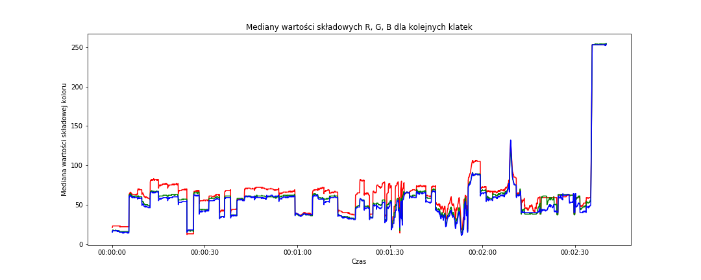

Tutaj jest dość podobnie, szczególnie w końcówce pełnego filmu (czyli z reklamami). Ciekawy jest pik w okolicach 2:10 - jest bardziej *spiczasty* co dobrze wróży.

Ciekawostką jest natomiast obszar od około 0:45 do 0:55. Na medianach RGB jest dość płasko, na średnich - mamy schody na składowej niebieskiej. Kadr prawie w pełni wypełniają twarze o dość podobnym odcieniu skóry - to jest przyczyną. Oczywiście w połączeniu z właściwością samej mediany.

**Sprawdźmy to samo w przestrzeni HSV:**

```{python eval=FALSE}
# średnie w przestrzeni HSV
fig = plt.figure(figsize=(15,6))
sns.lineplot(data=frame_data, x='time_s', y='mean_hue', color='red')
sns.lineplot(data=frame_data, x='time_s', y='mean_saturation', color='green')
sns.lineplot(data=frame_data, x='time_s', y='mean_value', color='blue')
plt.title('Średnie wartości składowych H, S, V dla kolejnych klatek')
plt.xlabel('Czas')
plt.ylabel('Średnia wartość składowej koloru')
plt.show()
```

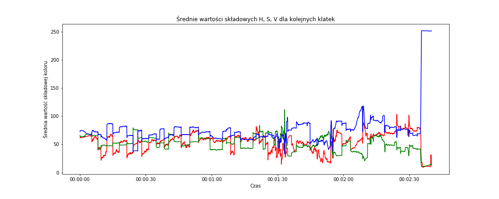

Na poziomie wartości uśrednionych po kanałach (składowych) H, S, V mamy podobny rozkład *zębów* (albo *schodków*) jak poprzednio, bardziej rozjeżdżają się składowe. To w sumie nic dziwnego - reprezentują coś innego. Powtarzam - nas interesuje zmiana wartości, a nie sama wartość. Z takiego punktu widzenia schody są podobne jak poprzednio.

**Na medianach składowych HSV** wygląda to podobnie:

```{python eval=FALSE}
# mediany w przestrzeni HSV
fig = plt.figure(figsize=(15,6))
sns.lineplot(data=frame_data, x='time_s', y='median_hue', color='red')
sns.lineplot(data=frame_data, x='time_s', y='median_saturation', color='green')
sns.lineplot(data=frame_data, x='time_s', y='median_value', color='blue')
plt.title('Mediany wartości składowych H, S, V dla kolejnych klatek')
plt.xlabel('Czas')
plt.ylabel('Mediana wartości składowej koloru')
plt.show()
```

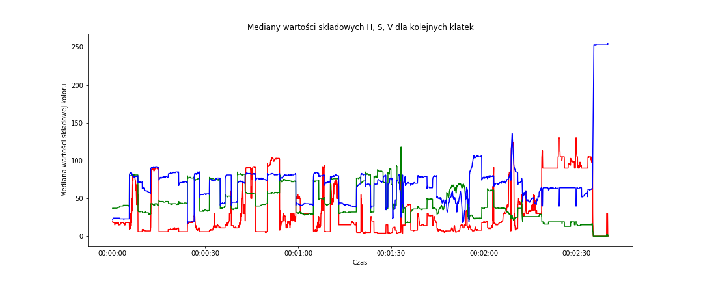

A gdyby uśrednić wszystkie trzy składowe i sprowadzić w ten sposób do jednej liczby dla każdej z klatek? Można będzie wówczas zbadać przebieg tylko tej jednej wartości. Uśrednijmy - zarówno średnie jak i mediany - w ramach obu przestrzeni barw:

```{python eval=FALSE}
# liczymy średnie ze składowych w ramach obu przestrzni barw,
# zarówno dla średnich jak i median
# zrobimy to na kopii oryginalnych danych
frame_data_means = frame_data.copy()

frame_data_means['mean_rgb'] = (frame_data_means['mean_red'] + frame_data_means['mean_green'] + frame_data_means['mean_blue'])/3
frame_data_means['median_rgb'] = (frame_data_means['median_red'] + frame_data_means['median_green'] + frame_data_means['median_blue'])/3

frame_data_means['mean_hsv'] = (frame_data_means['mean_hue'] + frame_data_means['mean_saturation'] + frame_data_means['mean_value'])/3
frame_data_means['median_hsv'] = (frame_data_means['median_hue'] + frame_data_means['median_saturation'] + frame_data_means['median_value'])/3

# pozostawiamy tylko potrzebne kolumny
frame_data_means = frame_data_means[['frame', 'time_s', 'mean_rgb', 'median_rgb', 'mean_hsv', 'median_hsv']]
```

I narysujmy to na wykresach:

```{python eval=FALSE}
# różnica pomiędzy średnimi w obu przestrzeniach barwnych
fig = plt.figure(figsize=(15,6))
sns.lineplot(data=frame_data_means, x='time_s', y='mean_rgb', color='red')
sns.lineplot(data=frame_data_means, x='time_s', y='mean_hsv', color='blue')
plt.title('Uśrednione wartości średnich składowych dla kolejnych klatek')
plt.xlabel('Czas')
plt.ylabel('Uśredniona wartość')
plt.show()
```

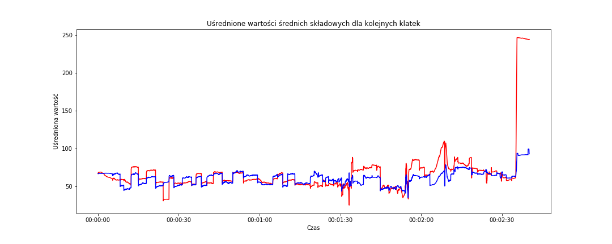


Schodki pojawiają się w podobnych miejscach jak poprzednio (może nieco złagodniały). Większych różnic pomiędzy przestrzeniami barw nie widać (w zasadniczej części filmu - do 2:10). Podobnie jest dla uśrednionych median:

```{python eval=FALSE}
# różnica pomiędzy medianami w obu przestrzeniach barwnych
fig = plt.figure(figsize=(15,6))
sns.lineplot(data=frame_data_means, x='time_s', y='median_rgb', color='red')
sns.lineplot(data=frame_data_means, x='time_s', y='median_hsv', color='blue')
plt.title('Uśrednione wartości median składowych dla kolejnych klatek')
plt.xlabel('Czas')
plt.ylabel('Uśredniona wartość')
plt.show()
```

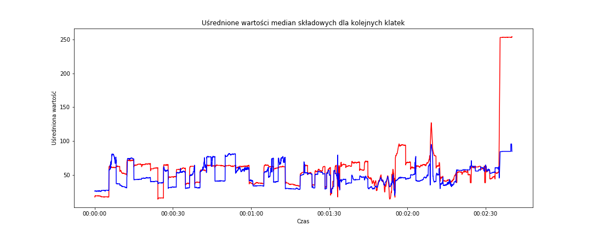

Doprowadziliśmy do tego, że potrafimy zobaczyć skoki poszczególnych parametrów - nieciągłość funkcji. Można zatem pokusić się o znaną z analizy matematycznej pochodną (używaną między innymi do badania zmienności funkcji). A gdyby tak prościej? Na przykład policzyć różnicę (właściwie zmianę procentową) między wartościami dla każdej z kolejnych klatek? O ile procent zmieniła się wartość średniej składowej niebieskiej między klatką dziesiątą a jedenastą? Spróbujmy. Ale już tylko dla uśrednionych wartości średnich i median w każdej z przestrzeni barw.

```{python eval=FALSE}
# procentowa różnica pomiędzy wartościami z kolejnych wierszy dla wskazanych kolumn
# 100* żeby mieć wartości w procentach
frame_data_means_changes = 100*frame_data_means[['mean_rgb', 'median_rgb',
                                             'mean_hsv', 'median_hsv']].pct_change()

# dodajemy do różnic informacje o czasie i numerze klatki
frame_data_means_changes = pd.concat([frame_data_means_changes,
                                      frame_data_means[['frame', 'time_s']]],
                                     axis=1)
```

I narysujmy wykres uśrednionej po składowych zmiany dla średniej i mediany w przestrzeni RGB:

```{python eval=FALSE}
# zmiana dla RGB
fig = plt.figure(figsize=(15,6))
sns.lineplot(data=frame_data_means_changes, x='time_s', y='mean_rgb', color='red')
sns.lineplot(data=frame_data_means_changes, x='time_s', y='median_rgb', color='blue')
plt.title('Zmiana uśrednionych wartości średniej i mediany składowych dla kolejnych klatek w przestrzni RGB')
plt.xlabel('Czas')
plt.ylabel('Zmiana wartości')
plt.ylim(-100, 100) # abu mieć ten sam zakres osi Y dla obu przestrzeni barw
plt.show()
```

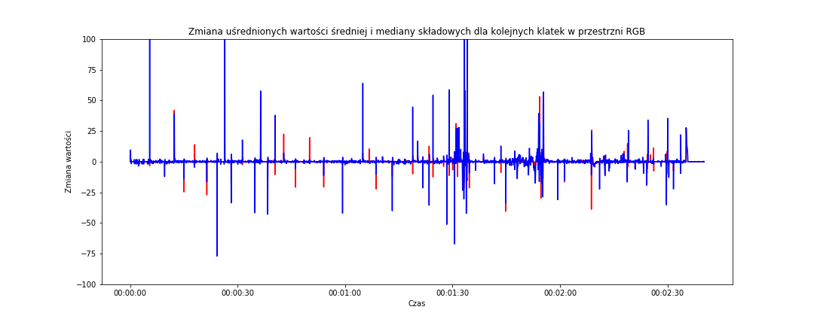

Widzimy, że niebieski kolor (czyli *procentowa zmiana wartości uśrednionej mediany składowych kolorów w przestrzeni RGB z kolejnych klatek* - zakręcone to, ale jeśli śledzisz tok myślenia od początku to na pewno wiesz o co biega :) na powyższym wykresie jest bardziej zmienny (szpilki zmian są wyższe).

**A w przestrzeni HSV?**

```{python eval=FALSE}
# zmiana dla HSV
fig = plt.figure(figsize=(15,6))
sns.lineplot(data=frame_data_means_changes, x='time_s', y='mean_hsv', color='red')
sns.lineplot(data=frame_data_means_changes, x='time_s', y='median_hsv', color='blue')
plt.title('Zmiana uśrednionych wartości średniej i mediany składowych dla kolejnych klatek w przestrzni HSV')
plt.xlabel('Czas')
plt.ylabel('Zmiana wartości')
plt.ylim(-100, 100)
plt.show()
```

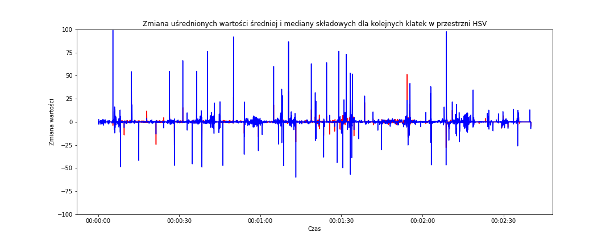

Jest podobnie - znowu niebieski (zatem zmiana mediany) jest bardziej *agresywny*. Na obu powyższych wykresach zastosowałem tę samą skalę dla osi Y - widać zatem od razu, że szpilki z przestrzeni HSV są wyższe i jest ich więcej. Czy to oznacza, że lepiej oddają cięcia pomiędzy ujęciami? Można tak założyć. Porównajmy jeszcze niebieskie szpilki z obu wykresów (jedna z nich będzie teraz czerwoną linią):

```{python eval=FALSE}
# zmiana dla median
fig = plt.figure(figsize=(15,6))
sns.lineplot(data=frame_data_means_changes, x='time_s', y='median_rgb', color='red')
sns.lineplot(data=frame_data_means_changes, x='time_s', y='median_hsv', color='blue', alpha=0.5)
plt.title('Zmiana uśrednionych wartości średniej i mediany składowych dla kolejnych klatek')
plt.xlabel('Czas')
plt.ylabel('Zmiana wartości')
plt.ylim(-100, 100)
plt.show()
```

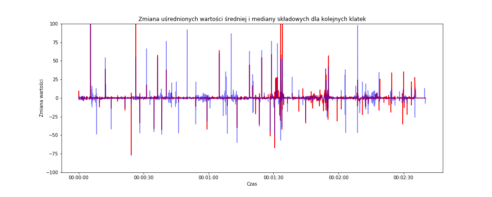

`alpha=0.5` dla linii niebieskiej (zmiana mediany HSV) powoduje, że jest ona nieco przeźroczysta i dzięki temu widać gdzie *pod nią* kończy się czerwona (zmiana mediany RGB). Widać ponownie, że linie odpowiedzialne za przestrzeń HSV są wyższe, bardziej dynamiczne. 

**Jak wygląda histogram tych różnic?**

```{python eval=FALSE}
fig = plt.figure(figsize=(15,6))
sns.distplot(frame_data_means_changes['median_hsv'], bins=500, rug=False, kde=False)
plt.title('Zmiana uśrednionych wartości średniej i mediany składowych dla kolejnych klatek')
plt.xlabel('Różnica uśrednionej mediany ze składowych HSV pomiędzy klatkami')
plt.ylabel('Liczba wystąpień\n(skala logarytmiczna)')
plt.yscale('symlog') # to daje nam logarytmiczną skalę osi Y
plt.show()
```

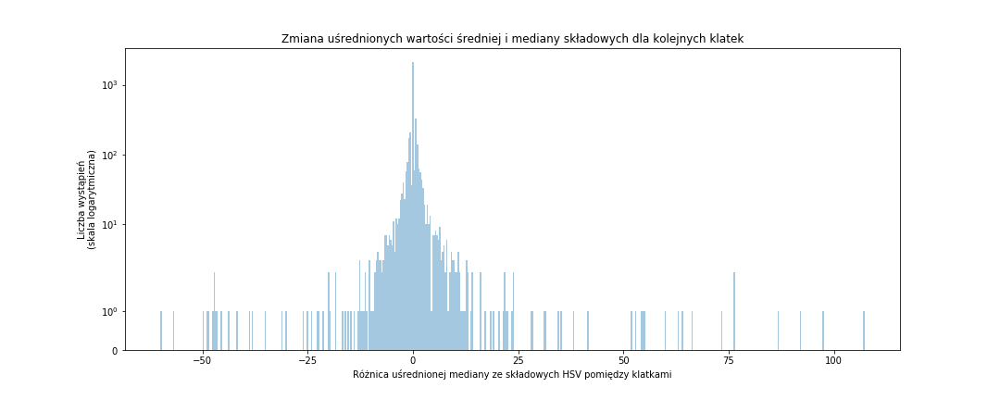

Na podstawie histogramu możemy określić próg zmiany procentowej parametru i tym samym wyznaczyć moment cięcia (jeśli zmiana wartości parametru pomiędzy dwoma klatkami jest ponad tym progiem mamy do czynienia z cięciem montażowym; pod uwagę weźmiemy wartość bezwzględną parametru aby było symetrycznie z obu stron zera). Oczywiście najwięcej będzie małych zmian, nas interesują te odstające wartości.

Zmniejszmy liczbę przedziałów i dodajmy *małe niebieskie kreseczki* pokazujący każdą z wartości:

```{python eval=FALSE}
fig = plt.figure(figsize=(15,6))
sns.distplot(frame_data_means_changes['median_hsv'], bins=100, rug=True, kde=False)
plt.title('Zmiana uśrednionych wartości średniej i mediany składowych dla kolejnych klatek')
plt.xlabel('Różnica uśrednionej mediany ze składowych HSV pomiędzy klatkami')
plt.ylabel('Liczba wystąpień\n(skala logarytmiczna)')
plt.yscale('symlog')
plt.show()
```

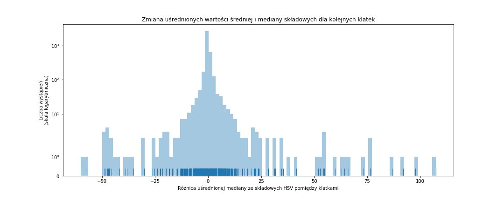

Osobiście wybrałbym **próg na poziomie około 15-20%**. Dlaczego? Kreseczek jest sporo pomiędzy -20 i 20, ale niemało ich ponad dwuziestką (czy to dodatnią czy ujemną) - może to sugerować, że są z jakiegoś powodu istotne. A przy okazji jest to na tyle duża zmiana, że może rzeczywiście oznaczać zmianę ujęcia. Porównajcie to z wysokością tych niebieskich szpilek gdzieś tam dwa/trzy wykresy wcześniej.


Przygotujmy zatem kolejny skrypt, który przetworzy kolejne klatki, dla każdej z nich obliczy zmianę parametru w stosunku do poprzedniej klatki i jeśli zmiana ta będzie ponad progiem - wyświetli obie sąsiadujące klatki:

```{python eval=FALSE}
import pandas as pd
import numpy as np
import cv2


# poniższe stałe możesz pobrać jako parametry wywołania skryptu

# ścieżka do pliku wideo
MOVIE_FILENAME = "movie/the-good-the-bad-and-the-ugly-1112-movie-clip-three-way-standoff-1966-hd.mp4"

# krok co 10 klatek, aby nie trwało to bardzo długo
FRAME_STEP = 10

# jaka różnica oznacza zmianę ujęcia?
THRESHOLD = 18


def get_frame_at(src, location):
    """
    Funkcja pobiera ramkę numer "location" z pliku "src" wideo 
    """
    cap = cv2.VideoCapture()
    cap.open(src)
    cap.set(cv2.CAP_PROP_POS_FRAMES, location)
    rst, frame = cap.read()
    cap.release()
    
    return rst, frame


# zaczynamy od początku
i = 0

# dowolna w sumie wartość
last_median_hsv = 1

while True:
    rst, frame = get_frame_at(MOVIE_FILENAME, i)

    # jeśli film się skończył to koniec
    if not rst:
        break

    # zmieniamy wielkość klatki
    frame = cv2.resize(frame, (640,360))

    # zostawiamy oryginalną ramkę w przestrzeni RGB
    org_frame = frame

    # jeśli początaek to porzednią klatką jest obecna
    if i == 0:
        last_frame = frame

    # zmieniamy przestrzeń barw
    frame = cv2.cvtColor(frame, cv2.COLOR_BGR2HSV)

    # pokazujemy ramkę w HSV
    cv2.imshow("Oryginalna klatka HSV", frame)

    # liczymy średnią z median ze składowych HSV
    median_hsv = (np.median(frame[:, :, 2]) + np.median(frame[:, :, 1]) + np.median(frame[:, :, 0])) / 3

    delta_hsv = 100*abs((median_hsv - last_median_hsv)/last_median_hsv)

    if delta_hsv > THRESHOLD:
        print("Cięcie na klatce {}, różnica wartości {}".format(i, delta_hsv))
        cv2.imshow("Po cięciu", org_frame)
        cv2.imshow("Przed cięciem", last_frame)


    # poprzednie staje sięobecnym
    last_median_hsv = median_hsv
    last_frame = org_frame

    # całość możemy przerwać Escape
    k = cv2.waitKey(10) & 0XFF
    if k == 27:
        break

    i += FRAME_STEP


# zamykamy wszystkie okienka
cv2.destroyAllWindows()
```

Gotowy skrypt możesz uruchomić z konsoli. W wyniku zobaczysz trzy okienka (aktualną klatkę  w przestrzni HSV oraz klatki przed i po wykrytym cięciu) oraz informację kiedy miało miejsce cięcie i jaka była różnica naszego wskaźnika. 


Mam nadzieję, że spodobał Ci się ten wpis. Nie było tutaj wiele odkrywczych rzeczy, ale też taki postawiłem sobie cel - pokazać proces dochodzenia do algorytmu poprzez analizę otrzymanych danych testowych.

Żeby było śmiesznie - nic w tym odkrywczego. Jest sobie pakiet [pySceneDetect](https://pyscenedetect.readthedocs.io/en/latest/) który robi to samo na kilka sposobów (a znalazłem go po zakończeniu prac nad własnym podejściem). Wyżej opisany znajdziecie w kodzie w klasie [ThresholdDetector](https://github.com/Breakthrough/PySceneDetect/blob/master/scenedetect/detectors/threshold_detector.py).
